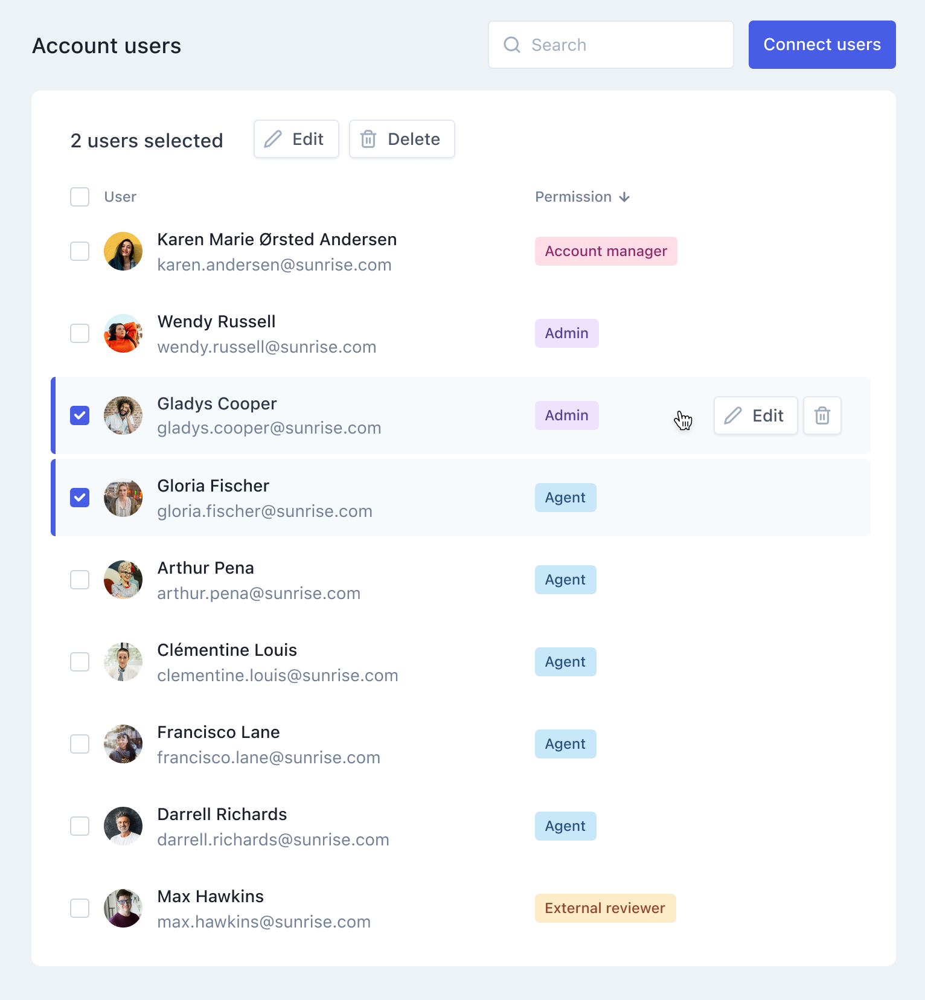

# Frontend Engineer Test Task

As a test task for [Klaus](https://www.klausapp.com) frontend engineering position, we ask our candidates to build the following small part of the users list using provided static data.

Reference design is hosted in [Figma](https://www.figma.com/) (account is needed for Inspect mode):
https://www.figma.com/file/OXpV1JmHeq9AMZqSWpC3tL/FE-Test-Task?node-id=1%3A528

Static JSON list of fake users is in this repository ([`users.json`](users.json)).

Please share your solution with us in the form of a public Git repository.

### Tasks

* Implement the given UI on a level of detail you deem necessary. Feel free to pick your own UI framework and libraries, preferrably something that is widely used like Vue or React, etc.
* UI has to be performant - feel free pick your approach on loading the data like creating a light dummy API interface around it or something totally different.

### Bonus
* Host it somewhere - the choice is yours.